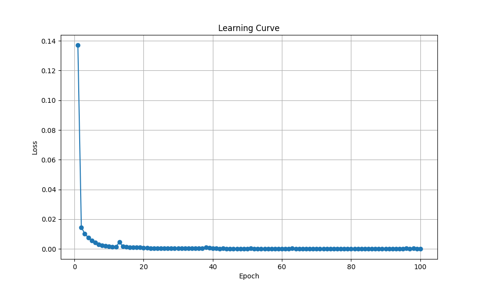
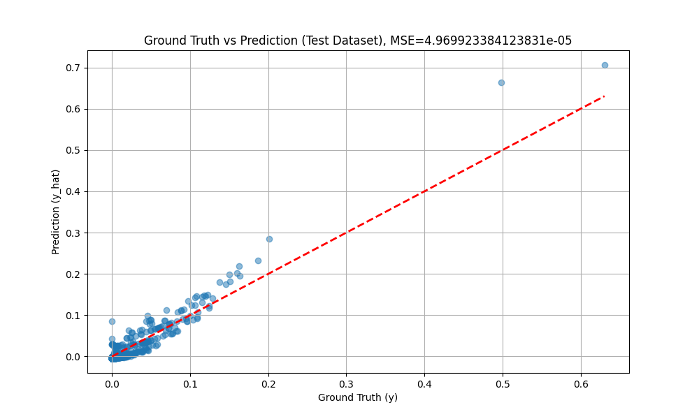
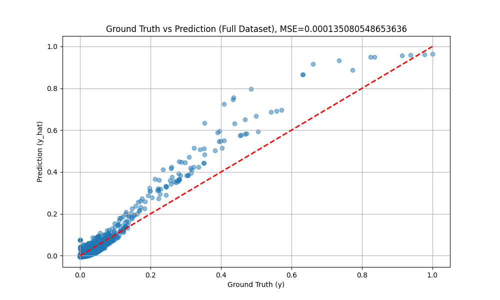

# Predicting River Outflow from Surface Water Extent Using a Transformer Model

## Project Overview

This project aims to predict the monthly river outflow (Q) based on the observed Surface Water Extent (SWE). By utilizing historical SWE and river outflow data, we use a machine learning model to understand the relationship between surface water presence and river outflow, which can be used for future forecasting. This model could assist in effective water resource management, especially in monitoring river discharge dynamics.

## Dataset Description

- **Date**: Represents the month and year during which the data was collected.
- **Q**: The outflow of the river, measured in cubic meters per second (m^3/s).
- **SWE**: Surface Water Extent, represented as a percentage of the total watermask that is covered by water (0-100%).
- **SWE_scaled**: Scaled version of SWE that is converted into the actual area of water present at the surface, measured in km^2.

We are trying to estimate the river outflow (“Q”) based on the SWE, which represents the extent of water visible on the surface of the river basin.

## Model Overview

We use a Transformer-based neural network for predicting river outflow (“Q”) based on the input feature, SWE_scaled. The model architecture is implemented using PyTorch, and the primary components are:

- **Input Layer**: Linear encoder to transform the input dimension to a suitable format for the Transformer.
- **Transformer Encoder-Decoder**: The main model, consisting of multi-head attention layers that can capture temporal dependencies.
- **Output Layer**: A linear decoder that predicts the corresponding river outflow value from the encoded representation.

The model is trained using Mean Squared Error (MSE) loss and optimized using Adam Optimizer.

## Data Preparation

- We read data from multiple CSV files, each representing SWE and river outflow data from different monitoring stations.
- Data is concatenated and preprocessed to fill in missing values (replacing zeros with a small positive value).
- Data is scaled using `MinMaxScaler` for improving the model training performance.
- The input feature “SWE_scaled” and target variable “Q” are split into training and testing sets.

## Model Training

- **Sequence Length**: We use a fixed-length sequence window of 10 for training.
- The Transformer model is trained for **100 epochs** with a batch size of **64**.
- A ReLU activation is applied after the encoding layer to add non-linearity.
- Data loaders for training and testing were used to streamline the batch processing.

The model is trained on the available environment using GPU (CUDA) if available or MPS on macOS, otherwise CPU.

## Evaluation

`eval_checkpoint.ipynb` script provides a manner to evaluate the model performance without retraining. 

- **Training Metrics**: Loss values are tracked across all epochs, and a plot of the learning curve is saved as `./figs/learning_curve.png`. Only generated in the training phase.
- **Prediction Evaluation**: Scatter plots of ground truth versus predicted river outflow values are created for both the test dataset and the full dataset. These plots are saved as:
  - `./figs/ground_truth_vs_prediction_test.png`
  - `./figs/ground_truth_vs_prediction_full.png`

These visualizations are helpful in understanding the performance of the model and the deviation between predicted and actual values.

## Results

- The model provides predictions for the river outflow (“Q”) based on SWE.
- Mean Squared Error (MSE) is used as the metric for evaluating both training and test datasets.
- The final scatter plots indicate the correlation between predicted and actual values, helping assess the model's reliability.

### Result Preview

Below are the visualizations generated from the evaluation process:

1. **Learning Curve**: The loss values over 100 epochs are tracked to show the model's learning progress. 

2. **Ground Truth vs Prediction (Test Dataset)**: A scatter plot showing the predicted versus actual river outflow values for the test dataset. This helps in visualizing the accuracy of the model on unseen data. 

3. **Ground Truth vs Prediction (Full Dataset)**: A scatter plot comparing the predicted versus actual values for the entire dataset, giving an overview of the model's overall performance. 

## How to Run the Project

1. Clone the repository and navigate to the project directory:
   ```bash
   git clone <repository-url>
   cd <repository-directory>
   ```

2. Install the required dependencies:

- Python 3.x
- Pandas
- Scikit-learn
- NumPy
- PyTorch
- Matplotlib

You can install the necessary Python packages by running:
```bash
pip install pandas scikit-learn numpy torch matplotlib
```

3. Make sure to have the data CSV files in the correct structure (`data/CSV/` directory).

4. Run the script to train the model and generate predictions:
   ```bash
   python main.py
   ```

5. Model checkpoints will be saved, and generated plots will be available in the `figs/` directory.

## License

This project is licensed under the MIT License - see the LICENSE file for details.
